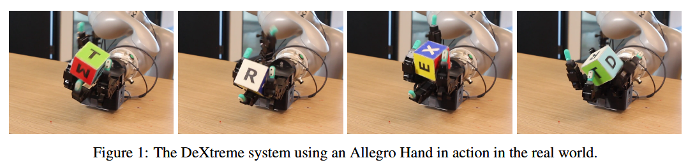

# This is a repository showcasing robot training examples, primarily utilized with Isaac Lab.

## 💡Dexterous Hand
### [1.DeXtreme: Transfer of Agile In-hand Manipulation from Simulation to Reality](https://arxiv.org/abs/2210.13702)

Train a robot hand for dexterous manipulation.[Click here to see details](./papers/README.md#1dextreme-transfer-of-agile-in-hand-manipulation-from-simulation-to-reality)
### [2.]()

## 💡Dexterous Hand