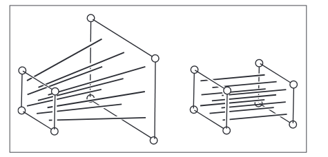
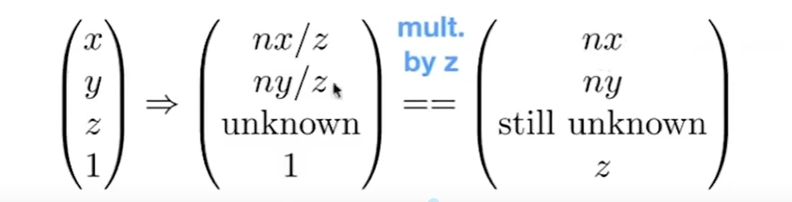

## Transformation

### 1.两个坐标系之间的变换
{ width=500px height=800px }

### 2. Open3d 中坐标系的变换
坐标系规定：X 轴向右，Y 轴向上，Z 轴按右手系垂直屏幕向外。
{ width=500px height=300px }
相机方向规定：手持相机，视线方向为 Z 轴负方向(front的反方向)，up 方向为没有修正过的 Y 轴方向(叉乘修正), X 轴在右手边<br>

```python
    vis = o3d.visualization.Visualizer()
    vis.create_window("3D Visualization Example", 800, 600)
    # vis.add_geometry(pcd)
    # vis.add_geometry(line_set)
    # 设置相机视角
    ctr = vis.get_view_control()
    target_point=[0, 0, 0] # 目标点位置
    eye_point = [0.0, 0.0, 0.5]  # 相机位置
    up_direction = [0, 1, 0]  # 向上方向(未修正的Y轴正向)
    ctr.set_front([target_point[i] - eye_point[i] for i in range(3)])  # 视线方向的反方向为z轴正向
    ctr.set_lookat(eye_point)
    ctr.set_up(up_direction)
    ctr.set_zoom(0.8)
    vis.run()
    vis.destroy_window()
```
在z轴上看向-z轴，z轴消失


### 3. 相机成像过程


#### Modeling Transformation
$M_w$
#### Camera Transformation
$M_{cam}$
#### Projection Transformation
$M_{per}$
perspective transformation + orthographic transformation
1） **orthographic transformation**:$\rightarrow\ canonical\ cube [-1,1]^3$


2） **perspective transformation:**
{ width=500px height=200px }
{ width=500px height=200px }
* 任意一点$(x,y,z,1)$的映射可以通过相似三角形得到,最终都与$z=n$处的成像平面大小相等
{ width=400px height=100px }

* Any point on the near plane will not change
* Any point's $z$ on the far plane will not change
$(x,y,n,1)\rightarrow(x,y,n,1)=(nx,ny,n^2,n)$
==> $(?,?,?,?)=(0,0,A,B)$ ==> $An+B=n^2$
$(0,0,f,1)\rightarrow(0,0,f,1)=(0,0,f^2,f)$
==> $Af+B=f^2$
==> $A=n+f,B=-nf$
so,$M_{persp\rightarrow{ortho}}
=\begin{bmatrix} n & 0 & 0 & 0\\ 0 & n & 0 & 0\\ 0 & 0 & n+f & -nf\\ 0 & 0 & 1 & 0\end{bmatrix},M_{per}=M_{ortho}M_{persp\rightarrow{ortho}}$

由于$M_{persp\rightarrow{ortho}} \begin{bmatrix} x\\ y\\ \frac{n+f}{2}\\ 1 \end{bmatrix}
=\begin{bmatrix} nx\\ ny\\ \frac{n^2+f^2}{2}\\ \frac{n+f}{2} \end{bmatrix}
=\begin{bmatrix} x\\ y\\ \frac{n^2+f^2}{n+f}\\ 1\end{bmatrix},f<n<0,\frac{n+f}{2}>\frac{n^2+f^2}{n+f},物体变远变小$

#### Viewport Transformation
$M_{mvp}$


#### Field of View

$ r=-l(x方向),u=-t(y方向),\frac{r}{t}=\frac{n_x}{n_y},且通过水平fov和垂直fov可以计算出r和t,\tan{\frac{\theta_{fov_x}}{2}}=\frac{t}{|n|}$


**ps:相机成像模型中是视锥体,而图像学中的成像模型是棱台,防止图像无限大,数值不稳定**