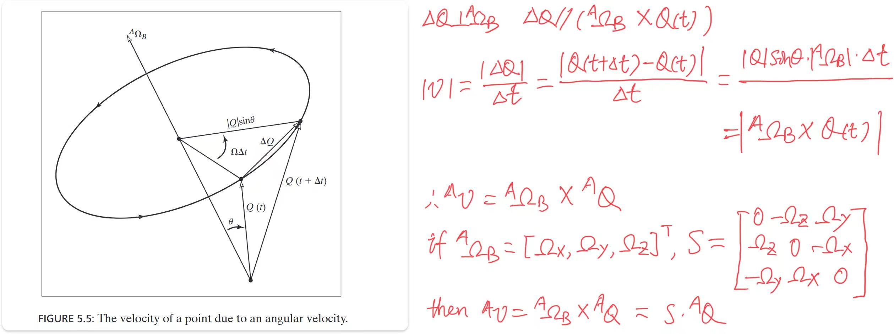
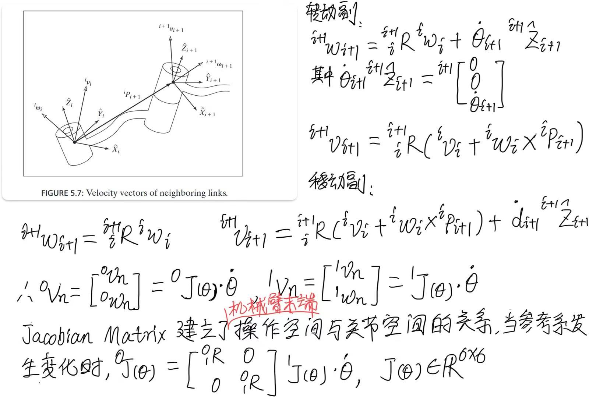
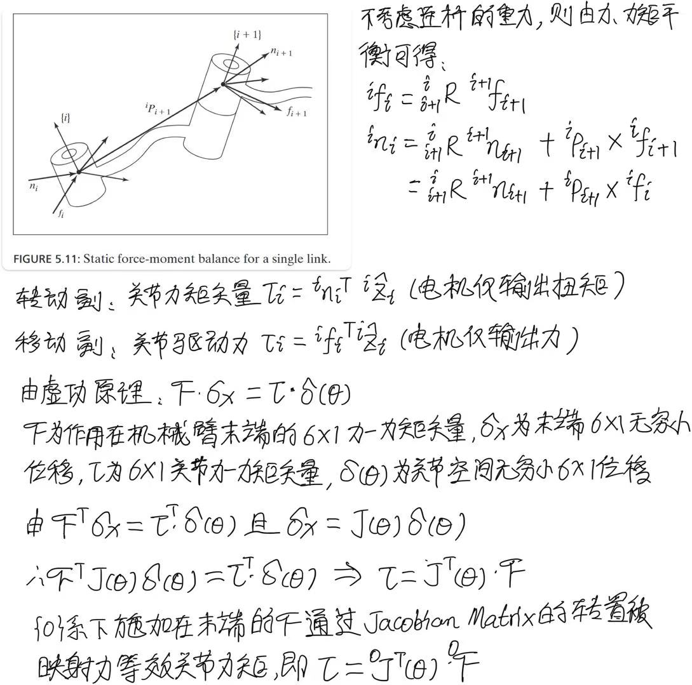
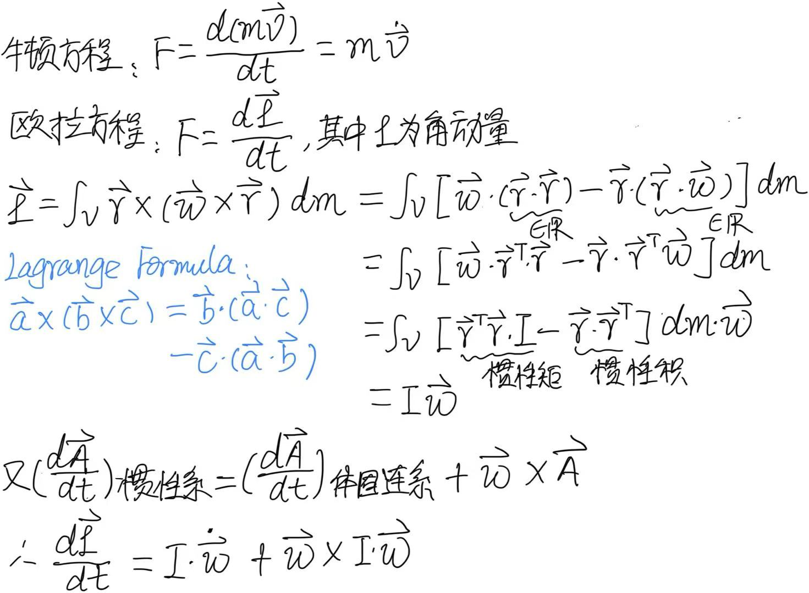
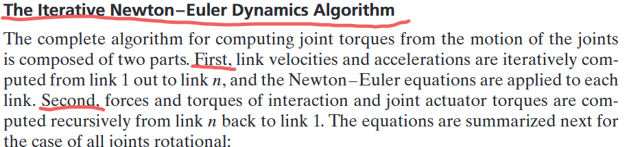
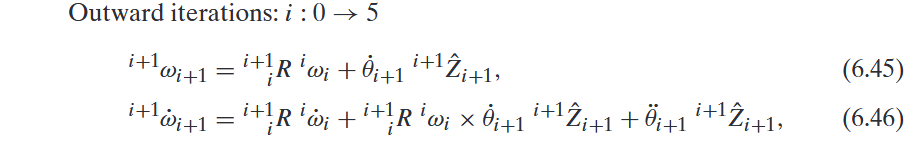
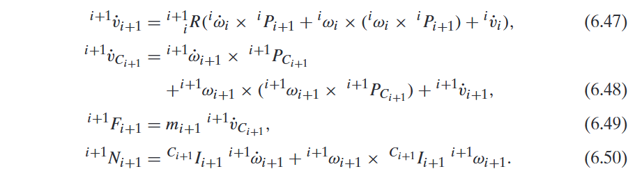
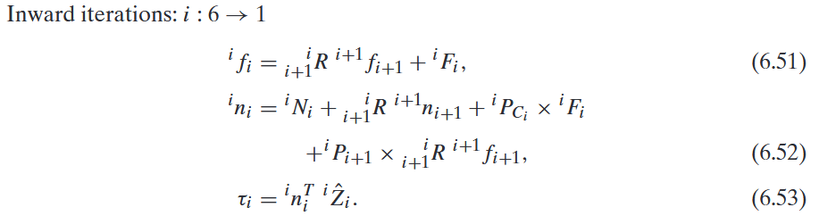
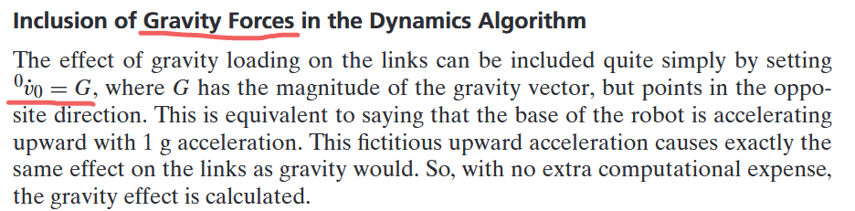

# 1. 速度和力域中的雅可比变换
## 1.1 角速度引起的速度

.png)

## 1.2 连杆之间速度的传递

## 1.3 连杆之间静力的传递

# 2. 动力学
## 2.1 牛顿-欧拉方程

## 2.2 牛顿-欧拉递推动力学算法
* 计算连杆 $0\rightarrow{n}$ 的速度、加速度
* 连杆 $0\rightarrow{n}$ 受力分析
* 关节 $(n+1)\rightarrow{1}$ 受力分析

