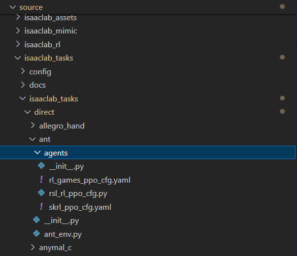
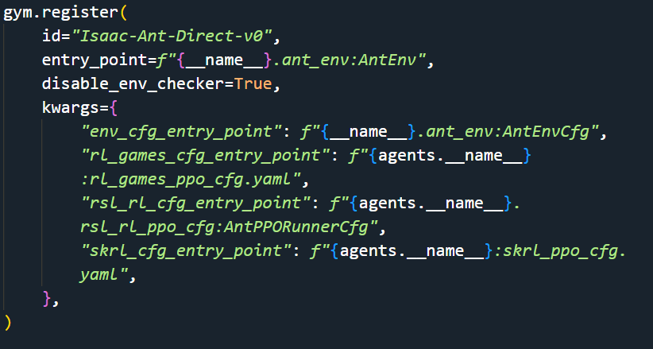

## 1. Simple examples 
**Ant & Franka Cabinet & Factory NutThread**
### 1.1 Direct Workflow 


环境定义文件 `ant_env.py`
`gym.make`配置文件`__init__.py`
`skrl`算法流程配置文件`skrl_ppo_cfg.yaml`


```bash
# 训练
python scripts/reinforcement_learning/skrl/train.py --task Isaac-Ant-Direct-v0 --livestream 2
# or
LIVESTREAM=2 python scripts/reinforcement_learning/skrl/train.py --task Isaac-Ant-Direct-v0 
```

### 1.2 ManageBased Workflow
同上

### 1.3 训练

```bash
# 训练
python -m torch.distributed.run --nnodes=1 --nproc_per_node=4 scripts/reinforcement_learning/rl_games/train.py --task Isaac-Factory-NutThread-Direct-v0 --distributed --headless #分布式训练
python scripts/reinforcement_learning/skrl/train.py --task Isaac-Franka-Cabinet-Direct-v0 --headless # 单机训练
```
### 1.4 结果可视化
```bash
./isaaclab.sh -p scripts/reinforcement_learning/rl_games/play.py --task Isaac-Factory-NutThread-Direct-v0  --num_envs 64  --livestream 2
./isaaclab.sh -p scripts/reinforcement_learning/skrl/play.py --task Isaac-Franka-Cabinet-Direct-v0  --num_envs 64  --video #录制视频
```