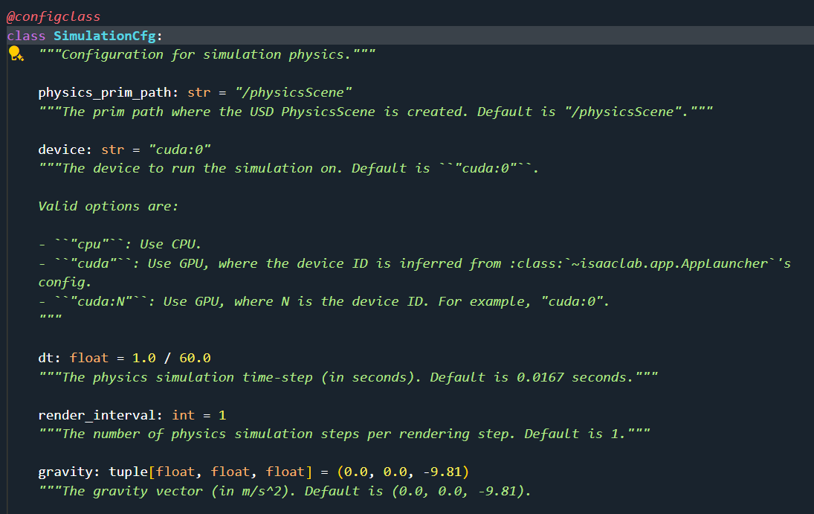

## 2. Dive into the code
**Direct Workflow**
### 2.1 Omniverse App Launched 
```python
import argparse 
from isaaclab.app import AppLauncher

# add argparse arguments
parser = argparse.ArgumentParser(description="Train an RL agent with skrl.")

parser.add_argument("......")

# append AppLauncher cli args
AppLauncher.add_app_launcher_args(parser)
# parse the arguments
args_cli = parser.parse_args()
# launch omniverse app
app_launcher = AppLauncher(args_cli)
simulation_app = app_launcher.app

```

### 2.2 Rendering Setting 
```python
# from isaaclab.envs import DirectRLEnvCfg,DirectRLEnv
class DirectRLEnv(gym.Env):
    def __init__(*args,**kwargs):
        # ...
        # create a simulation context to control the simulator
        if SimulationContext.instance() is None:
            self.sim: SimulationContext = SimulationContext(self.cfg.sim)
        else:
            raise RuntimeError("Simulation context already exists. Cannot create a new one.")
        # ...
        if self.sim.render_mode >= self.sim.RenderMode.PARTIAL_RENDERING:
            self.viewport_camera_controller = ViewportCameraController(self, self.cfg.viewer)
        else:
            self.viewport_camera_controller = None
        # ...
"""ViewportCameraController is used to set the viewpoint camera to track different origin types:
    - **world**: the center of the world (static)
    - **env**: the center of an environment (static)
    - **asset_root**: the root of an asset in the scene (e.g. tracking a robot moving in the scene)
"""

```

>Note:
All the scene designing must happen before the simulation starts. **Once the simulation starts, we recommend keeping the scene frozen and only altering the properties of the prim.** This is particularly important for GPU simulation as adding new prims during simulation may alter the physics simulation buffers on GPU and lead to unexpected behaviors.
<details>
<summary>set camera view through sim</summary>

```python
"""Rest everything follows."""
from isaaclab.sim import SimulationCfg, SimulationContext
def main():
    # Initialize the simulation context
    sim_cfg = SimulationCfg(dt=0.01) # dt: rate for rendering,means rendering 100 times per second, default is 1/60.
    sim = SimulationContext(sim_cfg) # render_interval: how many times for physical simulation per rendering step.Default is 1(decimation).
    # Set main camera
    sim.set_camera_view(eye = [2.5, 2.5, 2.5], target = [0.0, 0.0, 0.0]) 
    # Play the simulator
    sim.reset()
    # Now we are ready!
    print("[INFO]: Setup complete...")
    # Simulate physics
    while simulation_app.is_running():
        # perform step
        sim.step()
if __name__ == "__main__":
    # run the main function
    main()
    # close sim app
    simulation_app.close()
```

</details>

<details>
<summary>set camera view through DirectRLEnvCfg::ViewerCfg</summary>

```python
"""Actually in DirectRLEnvCfg, the viewer port setting and the rendering setting is seperated."""
from isaaclab.envs.common import ViewerCfg
from isaaclab.sim import SimualtionCfg
# from isaaclab.envs import DirectRLEnvCfg,DirectRLEnv
class DirectRLEnvCfg:
    # ...
    viewer: ViewerCfg = ViewerCfg() # 
    sim: SimulationCfg = SimulationCfg()
    # ...
```

</details>

### 2.3 Save Picture 
```python
# 在 train.py 中
# ...
# create isaac environment
env = gym.make(args_cli.task, cfg=env_cfg, render_mode="rgb_array" if args_cli.video else None)

# convert to single-agent instance if required by the RL algorithm
if isinstance(env.unwrapped, DirectMARLEnv) and algorithm in ["ppo"]:
    env = multi_agent_to_single_agent(env)

# wrap for video recording
if args_cli.video:
    video_kwargs = {
        "video_folder": os.path.join(log_dir, "videos", "train"),
        "step_trigger": lambda step: step % args_cli.video_interval == 0,
        "video_length": args_cli.video_length,
        "disable_logger": True,
    }
    print("[INFO] Recording videos during training.")
    print_dict(video_kwargs, nesting=4)
    env = gym.wrappers.RecordVideo(env, **video_kwargs)
    # 对原有的 env 增加记录视频的功能
# ...
```

```python
from isaaclab.envs import DirectRLEnvCfg,DirectRLEnv
"""
class DirectRLEnv(gym.Env):
    def __init__(*args,**kwargs):
        # ...
    def render(self,recompute:bool=False):
        #...
        # create the annotator if it does not exist
        if not hasattr(self, "_rgb_annotator"):
            import omni.replicator.core as rep

            # create render product
            self._render_product = rep.create.render_product(
                self.cfg.viewer.cam_prim_path, self.cfg.viewer.resolution
            )
            # create rgb annotator -- used to read data from the render product
            self._rgb_annotator = rep.AnnotatorRegistry.get_annotator("rgb", device="cpu")
            self._rgb_annotator.attach([self._render_product]) #当渲染产品生成图像时，附加到它的标注器就会接收到相应的数据。
        # obtain the rgb data
        rgb_data = self._rgb_annotator.get_data()      
        #...
"""
# why DirectRLEnvCfg()？ 
# @configclass 装饰后，会为其 1、添加类型注解, 2、保证每个实例的独特性，不共享内存，3、为类添加额外的功能函数，4、同时将其转换为 dataclass 类型
myenv = DirectRLEnv(DirectRLEnvCfg(),render_mode='rgb_array')
# how to get rgb frame?
rgb_data = myenv.render()
```

</details>