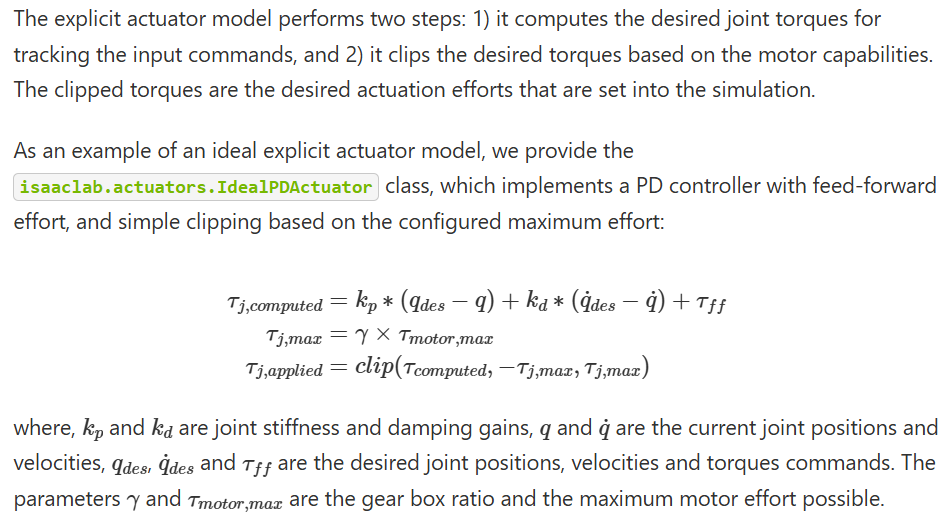
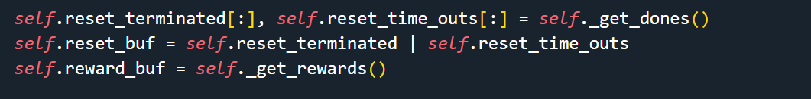

## 3. Direct workflow - Mujoco Humanoid
### 3.1 Create external repository
```bash
cd IsaacLab
# 查看已有的具身智能环境
# python scripts/environments/list_envs.py
# 创建环境 external 外部环境 OR internal 内部环境
# 创建方法 direct OR manager-based
./isaaclab.sh --new
```
```bash
python .vscode/tools/setup_vscode.py
# settings.json 中添加外部库路径
```


Once created, navigate to the installed project and run `python -m pip install -e source/<given-project-name>`

### 3.2 Direct Workflow
#### 3.2.1 Architecture


#### 3.2.2 Create environment and record frame
```python
import torch
import argparse
from isaaclab.app import AppLauncher
# add argparse arguments
parser = argparse.ArgumentParser(description="Train an RL agent with skrl.")
# append AppLauncher cli args
AppLauncher.add_app_launcher_args(parser)
# parse the arguments
args_cli = parser.parse_args()
args_cli.num_envs = 32
args_cli.headless = True
args_cli.enable_cameras = True  # 启用离屏渲染
# launch omniverse app
app_launcher = AppLauncher(args_cli)
simulation_app = app_launcher.app

from isaaclab.envs import DirectRLEnvCfg,DirectRLEnv
from mujoco_humanoid.tasks.direct.mujoco_humanoid.mujoco_humanoid_env_cfg import MujocoHumanoidEnvCfg
from mujoco_humanoid.tasks.direct.mujoco_humanoid.mujoco_humanoid_env import MujocoHumanoid

myenv = MujocoHumanoid(MujocoHumanoidEnvCfg(),render_mode='rgb_array')
# myenv = DirectRLEnv(DirectRLEnvCfg(),render_mode='rgb_array')
while simulation_app.is_running():
    actions = torch.zeros(myenv.action_space.shape, dtype=torch.float32)
    obs_buf, reward_buf, reset_terminated, reset_time_outs, extras = myenv.step(actions)
    rgb_data = myenv.render() 
    import matplotlib.pyplot as plt
    plt.imshow(rgb_data)
    
# close sim app
simulation_app.close()
```

#### 3.2.3 Articulation Control 
##### 1) Kinematics
一个机器人系统的构成 $<link_0,joint_0,...link_i,joint_i...link_n,joint_n>$
确定 root 连杆$link_0$的位姿 $<pos\in\R^3,rot\in\R^4,v\in\R^3,\omega\in\R^3>$ 以及所有关节的相对变动$<\omega\in\R>$
注：这些关节可能是移动副也可能是转动副，当移动副时$v\rightarrow{m/s}$,当转动副时$\omega\rightarrow{rad/s}$
通过运动学确定末端位姿公式：
$\begin{Bmatrix}^{ref}v_n\\^{ref}\omega_n\end{Bmatrix}=\begin{Bmatrix}^{ref}v_0\\^{ref}\omega_0\end{Bmatrix}+{^{ref}_0R}\ {^0J(\Theta)}\dot\Theta$

```python
HUMANOID_CFG = ArticulationCfg(prim_path=?,
                spawn=?,
                init_state=ArticulationCfg.InitialStateCfg(
                            pos=(0.0, 0.0, 1.34),joint_pos={".*": 0.0}),
                actuators=?)
# 根连杆隐式确定
# # root position
# pos: tuple[float, float, float] = (0.0, 0.0, 0.0)
# """Position of the root in simulation world frame. Defaults to (0.0, 0.0, 0.0)."""
# rot: tuple[float, float, float, float] = (1.0, 0.0, 0.0, 0.0)
# """Quaternion rotation (w, x, y, z) of the root in simulation world frame.
# Defaults to (1.0, 0.0, 0.0, 0.0).
# """
# # root velocity
# lin_vel: tuple[float, float, float] = (0.0, 0.0, 0.0)
# """Linear velocity of the root in simulation world frame. Defaults to (0.0, 0.0, 0.0)."""
# ang_vel: tuple[float, float, float] = (0.0, 0.0, 0.0)
# """Angular velocity of the root in simulation world frame. Defaults to (0.0, 0.0, 0.0)."""
# # joint state
# joint_pos: dict[str, float] = {".*": 0.0}
# """Joint positions of the joints. Defaults to 0.0 for all joints."""
# joint_vel: dict[str, float] = {".*": 0.0}
# """Joint velocities of the joints. Defaults to 0.0 for all joints."""
```


##### 2) Dynamics
Actuator's Function:
1. For position and velocity control, the physics engine internally implements a spring-damp (PD) controller which computes the torques applied on the actuated joints.
2. In torque-control, the commands are set directly as the joint efforts.
While this mimics an ideal behavior of the joint mechanism, it does not truly model how the drives work in the physical world. Thus, we provide a mechanism to inject external models to compute the joint commands that would represent the physical robot’s behavior.

Actuator models:
1. **implicit**: corresponds to the ideal simulation mechanism (provided by physics engine).`isaaclab.actuators.ImplicitActuator`
2. **explicit**: corresponds to external drive models (implemented by user). `isaaclab.actuators.IdealPDActuator`


```python
actuators={
    "body": ImplicitActuatorCfg(
        joint_names_expr=[".*"],
        stiffness={
            ".*_waist.*": 20.0,
            ".*_upper_arm.*": 10.0,
            "pelvis": 10.0,
            ".*_lower_arm": 2.0,
            ".*_thigh:0": 10.0,
            ".*_thigh:1": 20.0,
            ".*_thigh:2": 10.0,
            ".*_shin": 5.0,
            ".*_foot.*": 2.0,
        },
        damping={
            ".*_waist.*": 5.0,
            ".*_upper_arm.*": 5.0,
            "pelvis": 5.0,
            ".*_lower_arm": 1.0,
            ".*_thigh:0": 5.0,
            ".*_thigh:1": 5.0,
            ".*_thigh:2": 5.0,
            ".*_shin": 0.1,
            ".*_foot.*": 1.0,
        },
    ),
}
```
#### 3.2.4 Articulation State Obtain 
**1) step() 调用顺序**
UnitreeEnv::step() <- DirectRLEnv::step()
1. self._action_noise_model.apply(action) if have 
1. self._pre_physics_step(actions) 
1. self._apply_action() # Dynamics
1. self._get_dones() # Kinematics
1. self._get_rewards() 
1. self._reset_idx(reset_env_ids) if have 
1. self._get_observations() 
1. self._observation_noise_model.apply(self.obs_buf["policy"]) if have
```python
action = torch.zeros(myenv.action_space.shape, dtype=torch.float32)
obs_buf, reward_buf, reset_terminated, reset_time_outs, extras = myenv.step(action)
```
**2) This function performs the following steps**
1. Pre-process the actions before stepping through the physics.
2. Apply the actions to the simulator and step through the physics in a decimated manner.
3. Compute the reward and done signals. ⭐ Obtain termination state first before compute reward.

4. Reset environments that have terminated or reached the maximum episode length.
5. Apply interval events if they are enabled.
6. Compute observations.

**3) Compute Rewards**
```python
def compute_rewards(
    actions: torch.Tensor,
    reset_terminated: torch.Tensor,
    up_weight: float,
    heading_weight: float,
    heading_proj: torch.Tensor,
    up_proj: torch.Tensor,
    dof_vel: torch.Tensor,
    dof_pos_scaled: torch.Tensor,
    potentials: torch.Tensor,
    prev_potentials: torch.Tensor,
    actions_cost_scale: float,
    energy_cost_scale: float,
    dof_vel_scale: float,
    death_cost: float,
    alive_reward_scale: float,
    motor_effort_ratio: torch.Tensor,
):  
    # 保持前进朝向的奖励计算 
    heading_weight_tensor = torch.ones_like(heading_proj) * heading_weight
    heading_reward = torch.where(heading_proj > 0.8, heading_weight_tensor, heading_weight * heading_proj / 0.8)

    # 保持躯干直立的奖励计算 
    # aligning up axis of robot and environment
    up_reward = torch.zeros_like(heading_reward)
    up_reward = torch.where(up_proj > 0.93, up_reward + up_weight, up_reward)

    # energy penalty for movement
    # 关节力矩输出的惩罚计算
    actions_cost = torch.sum(actions**2, dim=-1)
    # 关节能量消耗的惩罚计算(功率)
    electricity_cost = torch.sum(
        torch.abs(actions * dof_vel * dof_vel_scale) * motor_effort_ratio.unsqueeze(0),
        dim=-1,
    )
    # 关节极限位置的惩罚计算
    # dof at limit cost
    dof_at_limit_cost = torch.sum(dof_pos_scaled > 0.98, dim=-1)

    # reward for duration of staying alive
    # 存活时间的奖励计算
    alive_reward = torch.ones_like(potentials) * alive_reward_scale
    # 衡量与目标接近程度的奖励计算
    progress_reward = potentials - prev_potentials

    total_reward = (
        progress_reward
        + alive_reward
        + up_reward
        + heading_reward
        - actions_cost_scale * actions_cost
        - energy_cost_scale * electricity_cost
        - dof_at_limit_cost
    )
    # 失败的robot奖励恒为-1
    # adjust reward for fallen agents
    total_reward = torch.where(reset_terminated, torch.ones_like(total_reward) * death_cost, total_reward)
    return total_reward
```

**4) Get Observations**
```python
def _get_observations(self) -> dict:
    obs = torch.cat(
        (
            self.torso_position[:, 2].view(-1, 1), # 躯干的 Z 轴位置
            self.vel_loc, # 躯干的局部线速度
            self.angvel_loc * self.cfg.angular_velocity_scale, # 躯干的局部角速度
            normalize_angle(self.yaw).unsqueeze(-1),
            normalize_angle(self.roll).unsqueeze(-1),
            normalize_angle(self.angle_to_target).unsqueeze(-1),
            self.up_proj.unsqueeze(-1), # 上方向投影
            self.heading_proj.unsqueeze(-1), # 前进方向投影
            self.dof_pos_scaled, # 调整后的关节角度
            self.dof_vel * self.cfg.dof_vel_scale,# 调整后的关节速度
            self.actions,# 上一个时间步施加的动作
        ),
        dim=-1,
    )
    observations = {"policy": obs}
    return observations
```


