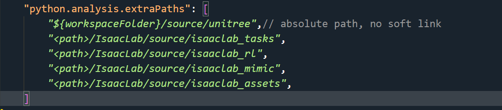
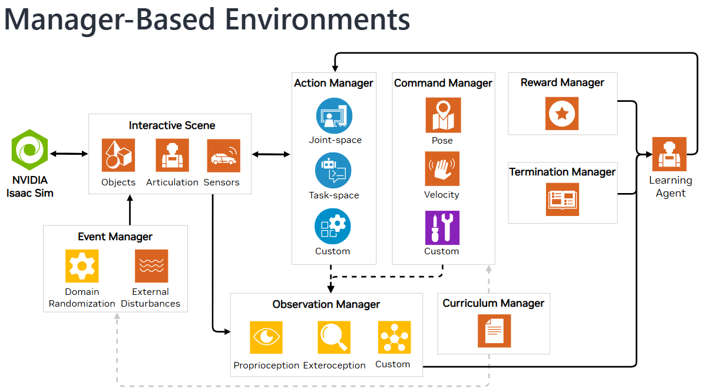
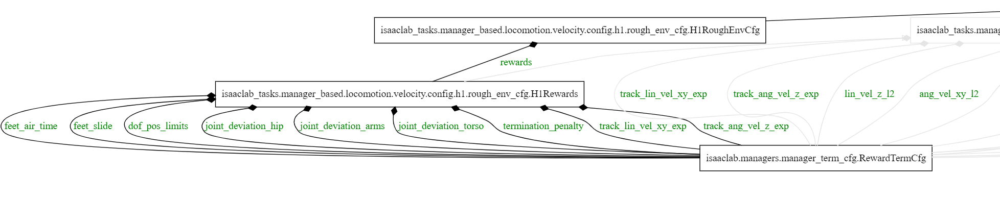
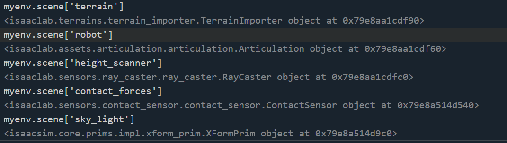
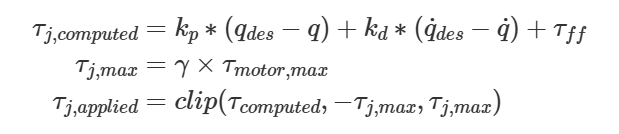

## 4. ManagerBased Workflow - Unitree H1
### 4.1 Create external repository
```bash
cd IsaacLab
# 查看已有的具身智能环境
# python scripts/environments/list_envs.py
# 创建环境 external 外部环境 OR internal 内部环境
# 创建方法 direct OR manager-based
./isaaclab.sh --new
```
```bash
python .vscode/tools/setup_vscode.py
# settings.json 中添加外部库路径
```


Once created, navigate to the installed project and run `python -m pip install -e source/<given-project-name>`


### 4.2 ManagerBased Workflow 

#### 4.2.1 Architecture

详情见 `H1RoughEnvCfg.dot`,vscode 需要安装 `Graphviz Preview` 扩展


#### 4.2.2 基础环境定义 
```python
from isaaclab.scene import InteractiveSceneCfg
@configclass
class MySceneCfg(InteractiveSceneCfg):
    # ground terrain 定义地形
    from isaaclab.terrains import TerrainImporterCfg
    # robots 定义机器人
    from isaaclab.assets import ArticulationCfg
    from dataclasses import MISSING
    robot:Articulationcfg = MISSING
    # sensors 定义传感器
    from isaaclab.sensors import ContactSensorCfg,RayCasterCfg
    # Note: The variable "{ENV_REGEX_NS}" represents "/World/envs/env_.*" means the number of robots in training.Such as "/World/envs/env_1/Robot/.*"
    # lights 定义光照
    from isaaclab.assets import AssetBaseCfg

from isaaclab.scene import InteractiveScene
scene=InteractiveScene(MySceneCfg(num_envs=2))
# state()  update()
```

#### 4.2.3 强化学习环境定义
```python
import isaaclab_tasks.manager_based.locomotion.velocity.mdp as mdp
# mdp 中定义了markov过程中涉及到的所有函数
from isaaclab.managers import ObservationGroupCfg as ObsGroup
# Basical Settings
@configclass
class ObservationsCfg: #定义观察
    @configclass
    class PolicyCfg(ObsGroup):
        # 设置所有观察变量，默认将所有观察到的 tensor concate 到一起
        pass
    policy: PolicyCfg = PolicyCfg()

@configclass
class ActionsCfg: #定义动作
    joint_pos = mdp.JointPositionActionCfg(asset_name="robot", joint_names=[".*"], scale=0.5, use_default_offset=True)
@configclass
class CommadsCfg: # 定义行为规则
    pass

# MDP Settings
@configclass
class EventCfg: #定义事件
    # 在开始（startup)、终止(reset)、周期性的(interval)重置机器人的状态
    pass

from isaaclab.managers import RewardTermCfg as RewTerm
@configclass
class RewardsCfg: #定义奖励信号
    # 基座
    # 奖励xy轴的线速度和绕z轴的角速度，惩罚z轴的线速度和绕xy周的角速度
    track_lin_vel_xy_exp = RewTerm(
        func=mdp.track_lin_vel_xy_exp, weight=1.0, params={"command_name": "base_velocity", "std": math.sqrt(0.25)}
    )
    #惩罚过大关节力矩，惩罚过大关节加速度，惩罚过快的动作变化，奖励滞空->屈膝，惩罚碰撞，（可选）姿态惩罚控制
    
@configclass
class TerminationsCfg: #定义终止条件
    pass

class CurriculumCfg: # curriculum learning
    pass

@configclass
from isaaclab.envs import ManagerBasedRLEnvCfg
class MyRobotEnvCfg(ManagerBasedRLEnvCfg):
    # Scene Settings
    scene:MySceneCfg = MySceneCfg(num_envs=4096,env_spacing=2.5)
    # Basic Settings
    obsevations: ObservationsCfg = ObservationsCfg()
    actions: ActionsCfg = ActionsCfg()
    commands: CommandsCfg = CommandsCfg()
    # MDP settings
    rewards: RewardsCfg = RewardsCfg()
    terminations: TerminationsCfg = TerminationsCfg()
    events: EventsCfg = EventsCfg()
    curriculum:CurriculumCfg = CurriculumCfg()
    def __pos__init__(self):
        # 初值设定
        pass

from isaaclab.envs import ManagerBasedRLEnv
myrobotenv=ManagerBasedRLEnv(MyRobotEnvCfg)
```

#### 4.2.4 Unitree H1 详细定义

```python
# 继承 RewardsCfg 重写奖励信号
@configclass
class H1Rewards(RewardsCfg):
    pass

# LocomotionVelocityRoughEnvCfg 继承 ManagerBasedRLEnvCfg
# 继承 LocomotionVelocityRoughEnvCfg 重新定义 强化学习环境
@configclass
class H1RoughEnvCfg(LocomotionVelocityRoughEnvCfg)：
    pass
```

#### 4.2.5 Create environment and record frame
```python
import torch
import argparse
from isaaclab.app import AppLauncher
# add argparse arguments
parser = argparse.ArgumentParser(description="Train an RL agent with skrl.")
# append AppLauncher cli args
AppLauncher.add_app_launcher_args(parser)
# parse the arguments
args_cli = parser.parse_args()
args_cli.num_envs = 32
args_cli.headless = True
args_cli.enable_cameras = True  # 启用离屏渲染
# launch omniverse app
app_launcher = AppLauncher(args_cli)
simulation_app = app_launcher.app

from isaaclab.envs import ManagerBasedRLEnvCfg,ManagerBasedRLEnv
from source.unitree.unitree.tasks.manager_based.unitree.rough_env_cfg import H1RoughEnvCfg
cfg = H1RoughEnvCfg()
cfg.scene.num_envs = 32
# 由于各种 manager 已经定义过，强化学习环境可以直接由 ManagerBasedRLEnv 初始化
myenv = ManagerBasedRLEnv(cfg,render_mode='rgb_array')

while simulation_app.is_running():
    actions = torch.zeros(myenv.action_space.shape, dtype=torch.float32)
    obs_buf, reward_buf, reset_terminated, reset_time_outs, extras = myenv.step(actions)
    rgb_data = myenv.render() 
    import matplotlib.pyplot as plt
    plt.imshow(rgb_data)
    

# close sim app
simulation_app.close()

```
**The step function performs the following steps:**
1. Process the actions.
2. Perform physics stepping.
3. Perform rendering if gui is enabled.
4. Update the environment counters and compute the rewards and terminations.
5. Reset the environments that terminated.
6. Compute the observations.
7. Return the observations, rewards, resets and extras.

#### 4.2.6 关节、连杆动力学属性
```python
H1_CFG = ArticulationCfg( 
    spawn=sim_utils.UsdFileCfg(?),
    init_state=ArticulationCfg.InitialStateCfg(
        pos=(0.0, 0.0, 1.05),
        joint_pos={
            ".*_hip_yaw": 0.0,
            ".*_hip_roll": 0.0,
            ".*_hip_pitch": -0.28,  # -16 degrees
            ".*_knee": 0.79,  # 45 degrees
            ".*_ankle": -0.52,  # -30 degrees
            "torso": 0.0,
            ".*_shoulder_pitch": 0.28,
            ".*_shoulder_roll": 0.0,
            ".*_shoulder_yaw": 0.0,
            ".*_elbow": 0.52,
        },
        joint_vel={".*": 0.0},
    )
    soft_joint_pos_limit_factor=0.9,
    actuators=?)
```

```python
from isaaclab.assets.articulation.articulation_data import ArticulationData
```
* **root joint 的初始位姿获取**
```bash
myenv.scene['robot'].data.default_root_state.shape
torch.Size([32, 13])
myenv.scene['robot'].data.default_root_state
tensor([[0.0000, 0.0000, 1.0500, 1.0000, 0.0000, 0.0000, 0.0000, 0.0000, 0.0000,
         0.0000, 0.0000, 0.0000, 0.0000],...])
```
13 表示 坐标3+角度4+线速度3+角速度3=13

* **other joint 的初始位姿获取**
```bash
# 关节角度
myenv.scene['robot'].data.default_joint_pos.shape
torch.Size([32, 19])
myenv.scene['robot'].data.default_joint_pos
tensor([[ 0.0000,  0.0000,  0.0000,  0.0000,  0.0000,  0.2800,  0.2800, -0.2800,
         -0.2800,  0.0000,  0.0000,  0.7900,  0.7900,  0.0000,  0.0000, -0.5200,
         -0.5200,  0.5200,  0.5200],...])


# 关节角速度(转动副只有角速度)
myenv.scene['robot'].data.default_joint_vel.shape
torch.Size([32, 19])
myenv.scene['robot'].data.default_joint_vel
tensor([[0., 0., 0., 0., 0., 0., 0., 0., 0., 0., 0., 0., 0., 0., 0., 0., 0., 0., 0.],...])
```
* **关节状态的获取**
```bash
# 获取关节名称
myenv.scene['robot'].data.joint_names
['left_hip_yaw', 'right_hip_yaw', 'torso', 'left_hip_roll', 'right_hip_roll', 'left_shoulder_pitch', 'right_shoulder_pitch', 'left_hip_pitch', 'right_hip_pitch', 'left_shoulder_roll', 'right_shoulder_roll', 'left_knee', 'right_knee', 'left_shoulder_yaw', 'right_shoulder_yaw', 'left_ankle', 'right_ankle', 'left_elbow', 'right_elbow'] # 顺序和 urdf 中的定义一致

# 读取关节 'left_hip_yaw' 的角度，速度
myenv.scene['robot'].data.joint_pos[:,0]
tensor([0.0785, 0.0785, 0.0785, 0.0785, 0.0785, 0.0785, 0.0785, 0.0785, 0.0785,
        0.0785, 0.0785, 0.0785, 0.0785, 0.0785, 0.0785, 0.0785, 0.0785, 0.0785,
        0.0785, 0.0785, 0.0785, 0.0785, 0.0785, 0.0785, 0.0785, 0.0785, 0.0785,
        0.0785, 0.0785, 0.0785, 0.0785, 0.0785], device='cuda:0')

myenv.scene['robot'].data.joint_vel[:,0]
tensor([6.1925, 6.1925, 6.1925, 6.1925, 6.1925, 6.1925, 6.1925, 6.1925, 6.1925,
        6.1925, 6.1925, 6.1925, 6.1925, 6.1925, 6.1925, 6.1925, 6.1925, 6.1925,
        6.1925, 6.1925, 6.1925, 6.1925, 6.1925, 6.1925, 6.1925, 6.1925, 6.1925,
        6.1925, 6.1925, 6.1925, 6.1925, 6.1925], device='cuda:0')

# 读取关节刚度 Kp 和 阻尼 Kd
myenv.scene['robot'].data.default_joint_stiffness.shape
torch.Size([32, 19])
myenv.scene['robot'].data.default_joint_stiffness
tensor([[150., 150., 200., 150., 150.,  40.,  40., 200., 200.,  40.,  40., 200.,
         200.,  40.,  40.,  20.,  20.,  40.,  40.],
# joint_damping: torch.Tensor = None
# """Joint damping provided to the simulation. Shape is (num_instances, num_joints)
# In the case of explicit actuators, the value for the corresponding joints is zero.
# """

```
* **连杆状态的获取**
```bash
# urdf文件定义link属性
  <link name="left_hip_yaw_link">
    <inertial>
      <origin xyz="-0.04923 0.0001 0.0072" rpy="0 0 0" />
      <mass value="2.244" />
      <inertia ixx="0.0025731" ixy="9.159E-06" ixz="-0.00051948" iyy="0.0030444" iyz="1.949E-06" izz="0.0022883" />
    </inertial>
    <visual>
      <origin xyz="0 0 0" rpy="0 0 0" />
      <geometry>
        <mesh filename="package://h1_description/meshes/left_hip_yaw_link.dae" />
      </geometry>
      <material name="Material_017-effect"><color rgba="0.1 0.1 0.1 1" /></material></visual>
        <collision>
      <origin xyz="0.02 0 0" rpy="0 1.5707963267948966192313216916398 0" />
      <geometry>
        <cylinder radius="0.01" length="0.02" />
      </geometry>
    </collision>
  </link>
```

```bash
# 连杆名称
myenv.scene['robot'].data.body_names
['pelvis', 'left_hip_yaw_link', 'right_hip_yaw_link', 'torso_link', 'left_hip_roll_link', 'right_hip_roll_link', 'left_shoulder_pitch_link', 'right_shoulder_pitch_link', 'left_hip_pitch_link', 'right_hip_pitch_link', 'left_shoulder_roll_link', 'right_shoulder_roll_link', 'left_knee_link', 'right_knee_link', 'left_shoulder_yaw_link', 'right_shoulder_yaw_link', 'left_ankle_link', 'right_ankle_link', 'left_elbow_link', 'right_elbow_link']

# 连杆质量
myenv.scene['robot'].data.default_mass.shape
torch.Size([32, 20])
myenv.scene['robot'].data.default_mass
tensor([[ 5.3900,  2.2440,  2.2440, 17.7890,  2.2320,  2.2320,  1.0330,  1.0330,
          4.1520,  4.1520,  0.7930,  0.7930,  1.7210,  1.7210,  0.8390,  0.8390,
          0.4460,  0.4460,  0.6690,  0.6690],...])

# 连杆惯性矩阵（正定 对称 3x3）
myenv.scene['robot'].data.default_inertia.shape
torch.Size([32, 20, 9])
myenv.scene['robot'].data.default_inertia
tensor([[[0.0490, 0.0000, 0.0000,  ..., 0.0000, 0.0000, 0.0082],...]])
```

* **关节角度限制**
```python
soft_joint_pos_limits: torch.Tensor = None
r"""Soft joint positions limits for all joints. Shape is (num_instances, num_joints, 2).

The limits are in the order :math:`[lower, upper]`.The soft joint position limits are computed as
a sub-region of the :attr:`joint_pos_limits` based on the
:attr:`~isaaclab.assets.ArticulationCfg.soft_joint_pos_limit_factor` parameter.

Consider the joint position limits :math:`[lower, upper]` and the soft joint position limits
:math:`[soft_lower, soft_upper]`. The soft joint position limits are computed as:

.. math::

    soft\_lower = (lower + upper) / 2 - factor * (upper - lower) / 2
    soft\_upper = (lower + upper) / 2 + factor * (upper - lower) / 2

The soft joint position limits help specify a safety region around the joint limits. It isn't used by the
simulation, but is useful for learning agents to prevent the joint positions from violating the limits.
"""
```
关节角度的限制 `[lower, upper]` 通过读取 usd 文件、 urdf 文件确定
```bash
# urdf
  <joint name="left_hip_yaw_joint" type="revolute">
    <origin xyz="0 0.0875 -0.1742" rpy="0 0 0" />
    <parent link="pelvis" />
    <child link="left_hip_yaw_link" />
    <axis xyz="0 0 1" />
    <limit lower="-0.43" upper="0.43" effort="200" velocity="23" />
  </joint>
```
```bash
myenv.scene['robot'].data.soft_joint_pos_limits.shape
torch.Size([32, 19, 2])

myenv.scene['robot'].data.soft_joint_pos_limits
tensor([[[-0.3870,  0.3870],
         [-0.3870,  0.3870],
         [-2.1150,  2.1150],...]])
```

* **关节速度限制**
```python
soft_joint_vel_limits: torch.Tensor = None
"""Soft joint velocity limits for all joints. Shape is (num_instances, num_joints).

These are obtained from the actuator model. It may differ from :attr:`joint_vel_limits` if the actuator model
has a variable velocity limit model. For instance, in a variable gear ratio actuator model.
"""
H1_CFG = ArticulationCfg(
    spawn=sim_utils.UsdFileCfg(?),
    init_state=ArticulationCfg.InitialStateCfg(?),
    soft_joint_pos_limit_factor=0.9,
    actuators={  # Note：
                        # 1. 'legs','feet','arms' just make code easy to read.
                        # 2. There is no need for making kd(damping) & kp(stiffness) same with urdf,except Sim2Real.
        "legs": ImplicitActuatorCfg(
            joint_names_expr=[".*_hip_yaw", ".*_hip_roll", ".*_hip_pitch", ".*_knee", "torso"],
            effort_limit=300,
            velocity_limit=100.0,
            stiffness={
                ".*_hip_yaw": 150.0,
                ".*_hip_roll": 150.0,
                ".*_hip_pitch": 200.0,
                ".*_knee": 200.0,
                "torso": 200.0,
            },
            damping={
                ".*_hip_yaw": 5.0,
                ".*_hip_roll": 5.0,
                ".*_hip_pitch": 5.0,
                ".*_knee": 5.0,
                "torso": 5.0,
            },
        ),
        "feet": ImplicitActuatorCfg(
            joint_names_expr=[".*_ankle"],
            effort_limit=100,
            velocity_limit=100.0,
            stiffness={".*_ankle": 20.0},
            damping={".*_ankle": 4.0},
        ),
        "arms": ImplicitActuatorCfg(
            joint_names_expr=[".*_shoulder_pitch", ".*_shoulder_roll", ".*_shoulder_yaw", ".*_elbow"],
            effort_limit=300,
            velocity_limit=100.0,
            stiffness={
                ".*_shoulder_pitch": 40.0,
                ".*_shoulder_roll": 40.0,
                ".*_shoulder_yaw": 40.0,
                ".*_elbow": 40.0,
            },
            damping={
                ".*_shoulder_pitch": 10.0,
                ".*_shoulder_roll": 10.0,
                ".*_shoulder_yaw": 10.0,
                ".*_elbow": 10.0,
            },
        ),
    })
```
关节速度的限制，根据 actuator model 得出。

#### 4.2.7 ../mdp/\* 下功能函数的作用
* **../mdp/\* 下的功能函数定义了状态转移过程中的所有操作**
```python
@configclass
class EventCfg:
    """Configuration for events."""
    # startup
    ...
    # reset
    reset_base = EventTerm(
        func=mdp.reset_root_state_uniform,
        mode="reset",
        params={
            "pose_range": {"x": (-0.5, 0.5), "y": (-0.5, 0.5), "yaw": (-3.14, 3.14)},
            "velocity_range": {
                "x": (-0.5, 0.5),
                "y": (-0.5, 0.5),
                "z": (-0.5, 0.5),
                "roll": (-0.5, 0.5),
                "pitch": (-0.5, 0.5),
                "yaw": (-0.5, 0.5),
            },
        },
    ) # 重置每个 robot 的 root 的位置和速度
    reset_robot_joints = EventTerm(
        func=mdp.reset_joints_by_scale,
        mode="reset",
        params={
            "position_range": (0.5, 1.5),
            "velocity_range": (0.0, 0.0),
        },
    ) # 重置每个关节的初始状态
    # intervel
    ...
```

* **重置每个 robot 的 root 的位置和速度**
```python
def reset_root_state_uniform(
    env: ManagerBasedEnv,
    env_ids: torch.Tensor,
    pose_range: dict[str, tuple[float, float]],
    velocity_range: dict[str, tuple[float, float]],
    asset_cfg: SceneEntityCfg = SceneEntityCfg("robot"),
):
    pass
```

* **重置每个关节的初始状态**
```python
def reset_joints_by_scale(
    env: ManagerBasedEnv,
    env_ids: torch.Tensor,
    position_range: tuple[float, float],
    velocity_range: tuple[float, float],
    asset_cfg: SceneEntityCfg = SceneEntityCfg("robot"),
):
    """Reset the robot joints by scaling the default position and velocity by the given ranges.

    This function samples random values from the given ranges and scales the default joint positions and velocities
    by these values. The scaled values are then set into the physics simulation.
    """
    # extract the used quantities (to enable type-hinting)
    asset: Articulation = env.scene[asset_cfg.name]
    # get default joint state
    joint_pos = asset.data.default_joint_pos[env_ids].clone()
    joint_vel = asset.data.default_joint_vel[env_ids].clone()

    # scale these values randomly
    joint_pos *= math_utils.sample_uniform(*position_range, joint_pos.shape, joint_pos.device) # 关节角度乘以从均匀分布(0.5, 1.5)中采样的采样系数
    joint_vel *= math_utils.sample_uniform(*velocity_range, joint_vel.shape, joint_vel.device) # 关节速度乘以从均匀分布(0, 0)中采样的采样系数

    # 保证速度、角度在范围内
    # clamp joint pos to limits
    joint_pos_limits = asset.data.soft_joint_pos_limits[env_ids]
    joint_pos = joint_pos.clamp_(joint_pos_limits[..., 0], joint_pos_limits[..., 1])
    # clamp joint vel to limits
    joint_vel_limits = asset.data.soft_joint_vel_limits[env_ids]
    joint_vel = joint_vel.clamp_(-joint_vel_limits, joint_vel_limits)

    # set into the physics simulation
    asset.write_joint_state_to_sim(joint_pos, joint_vel, env_ids=env_ids)
```


#### 4.2.8 Actions 
```python
from isaaclab.envs.mdp.actions.joint_actions import JointPositionAction
```

```python

@configclass
class ActionsCfg:
    """Action specifications for the MDP."""

    joint_pos = mdp.JointPositionActionCfg(asset_name="robot", joint_names=[".*"], scale=0.5, use_default_offset=True)

class JointAction(ActionTerm):
    # 
    ....
    def process_actions(self, actions: torch.Tensor):
        # store the raw actions
        self._raw_actions[:] = actions
        # apply the affine transformations
        self._processed_actions = self._raw_actions * self._scale + self._offset
        # clip actions
        if self.cfg.clip is not None:
            self._processed_actions = torch.clamp(
                self._processed_actions, min=self._clip[:, :, 0], max=self._clip[:, :, 1]
            )
    #
    ....
```
**`use_default_offset=True (增量模式 / Delta Actions)`**
动作为相对于初始状态的偏移，`实际角度=缩放系数*动作+初始角度`

**use_default_offset=False (绝对模式 / Absolute Actions)**
动作为实际角度

`Actions` 是为了得到关节应该达到的角度，通过 `Actuator Model` 计算出最终电机施加在关节上的力和力矩，从而指导机器人到达下一个状态

