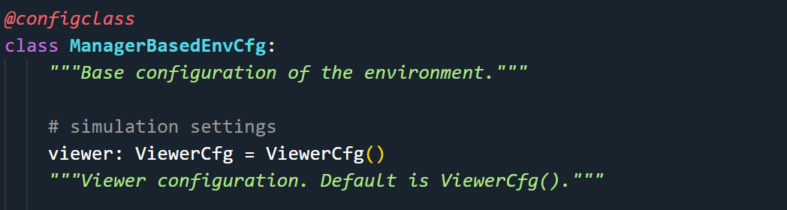
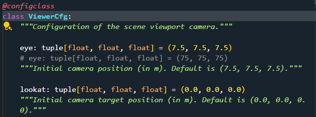

# IsaacLab
This is a repository mainly showcasing the usage of IsaacLab.
## Content
[0. Installation](./0.%20Installation/README.md)
[1. Simple examples](./1.%20Simple%20examples/README.md)
[2. Dive into the code](./2.%20Dive%20into%20the%20code/README.md)
[3. Direct Workflow](./3.%20Direct%20Workflow/README.md)
[4. ManagerBased Workflow](./4.%20ManagerBased%20Workflow/README.md)
[5. Skrl Algorithm API]
[6. Train your own robot]


## 5. Skrl Algorithm API
### 5.1 ..../skrl/train.py
```bash
TODO
```
### 5.2 ..../skrl/play.py
```bash
# isaaclab_tasks.manager_based.locomotion.velocity.config.h1.rough_env_cfg.H1RoughEnvCfg()
['actions', 'commands', 'curriculum', 'decimation', 'episode_length_s', 'events', 'is_finite_horizon', 'observations', 'recorders', 'rerender_on_reset', 'rewards', 'scene', 'seed', 'sim', 'terminations', 'validate', 'viewer', 'wait_for_textures', 'xr']
# 默认视角
# isaaclab_tasks.manager_based.locomotion.velocity.config.h1.rough_env_cfg.H1RoughEnvCfg().viewer
ViewerCfg(eye=(7.5, 7.5, 7.5), lookat=(0.0, 0.0, 0.0), cam_prim_path='/OmniverseKit_Persp', resolution=(1280, 720), origin_type='world', env_index=0, asset_name=None, body_name=None)
```
`H1RoughEnvCfg <- LocomotionVelocityRoughEnvCfg <- ManagerBasedRLEnvCfg <- ManagerBasedEnvCfg`

`isaaclab.envs.common.ViewerCfg` 


## 6. Train your own robot
### 6.1 Create external repository
```bash
cd IsaacLab
# 查看已有的具身智能环境
# python scripts/environments/list_envs.py
# 创建环境 external 外部环境 OR internal 内部环境
# 创建方法 direct OR manager-based
./isaaclab.sh --new
```
```bash
python .vscode/tools/setup_vscode.py
# settings.json 中添加外部库路径
```


Once created, navigate to the installed project and run `python -m pip install -e source/<given-project-name>`


### 6.2 RX-V3 robot