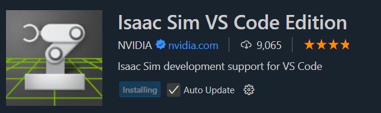
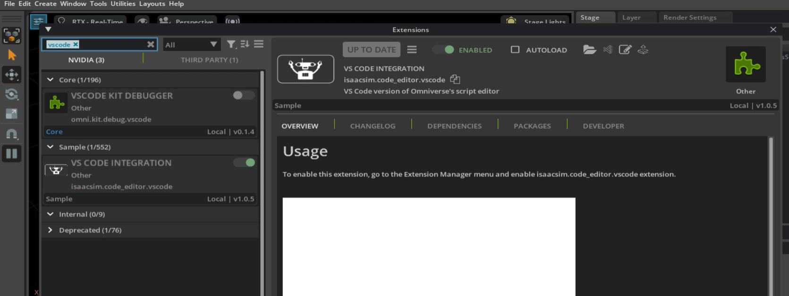
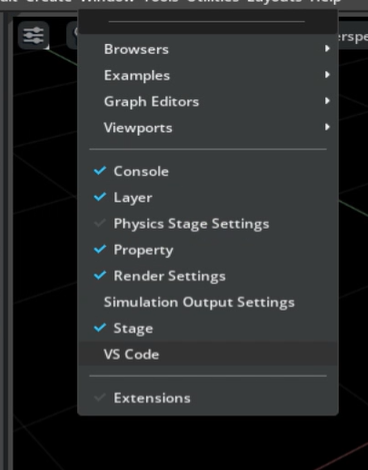

# IsaacLab 安装 
教程来源：https://isaac-sim.github.io/IsaacLab/main/source/setup/installation/isaaclab_pip_installation.html


### isaacsim 环境配置
```bash
conda create -n lab python=3.10
conda activate lab

pip install torch==2.5.1 torchvision==0.20.1 --index-url https://download.pytorch.org/whl/cu118

pip install --upgrade pip
# 40系显卡
pip install isaaclab[isaacsim,all]==2.1.0 --extra-index-url https://pypi.nvidia.com 

## 安装检查
isaacsim 

## 脚本启动
isaacsim isaacsim4.5.0/apps/isaacsim.exp.full.kit
```
### isaaclab 环境配置
#### 1. 基础环境配置
```bash
git clone git@github.com:isaac-sim/IsaacLab.git
sudo apt install cmake build-essential

cd IsaacLab
./isaaclab.sh --install # or "./isaaclab.sh -i"

# 安装检查
# Option 1: Using the isaaclab.sh executable
# note: this works for both the bundled python and the virtual environment
./isaaclab.sh -p scripts/tutorials/00_sim/create_empty.py
# Option 2: Using python in your virtual environment
python scripts/tutorials/00_sim/create_empty.py
```
#### 2. vscode 环境配置
* 基本设置
```bash
python IsaacLab/.vscode/tools/setup_vscode.py # 将自动增加launch.json、settings.json 配置 vscode
```
源码的函数定义可以索引


* debug 插件安装


isaacsim app 启用 vscode




