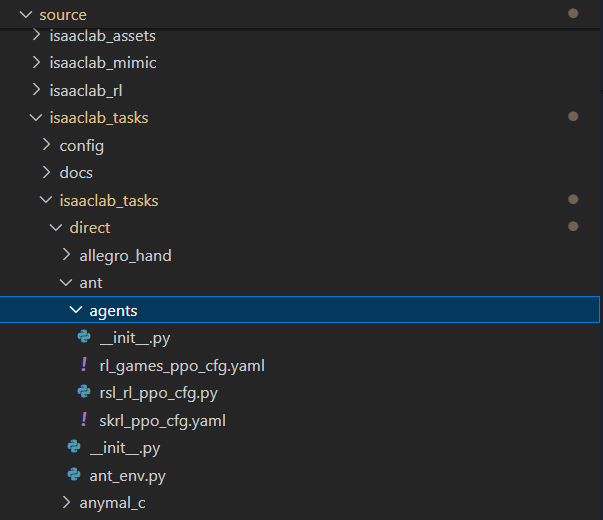

# IsaacLab的使用
目录
[1.环境初始化](#环境初始化)
[2.训练自己的机器人](#训练自己的机器人)


## 1. 环境初始化
### 1.1 已有环境分析
**Direct Workflow**

环境定义文件 `ant_env.py`
`gym.make`配置文件`__init__.py`
`skrl`算法流程配置文件`skrl_ppo_cfg.yaml`

```bash
# 训练
python scripts/reinforcement_learning/skrl/train.py --task Isaac-Ant-Direct-v0 --livestream 2
# or
LIVESTREAM=2 python scripts/reinforcement_learning/skrl/train.py --task Isaac-Ant-Direct-v0 
```

**ManagerBased Workflow 同上** 

### 1.2 训练
```bash
# 训练
python -m torch.distributed.run --nnodes=1 --nproc_per_node=4 scripts/reinforcement_learning/rl_games/train.py --task Isaac-Factory-NutThread-Direct-v0 --distributed --headless #分布式训练
python scripts/reinforcement_learning/skrl/train.py --task Isaac-Franka-Cabinet-Direct-v0 --headless # 单机训练
# 结果可视化
./isaaclab.sh -p scripts/reinforcement_learning/rl_games/play.py --task Isaac-Factory-NutThread-Direct-v0  --num_envs 64  --livestream 2
./isaaclab.sh -p scripts/reinforcement_learning/skrl/play.py --task Isaac-Franka-Cabinet-Direct-v0  --num_envs 64  --video #录制视频
```


### 1.3 环境初始化相关 API
<details>
<summary> 场景模拟 </summary>

```python
import argparse
from isaaclab.app import AppLauncher
# create argparser
parser = argparse.ArgumentParser(description="Tutorial on creating an empty stage.")
# append AppLauncher cli args
AppLauncher.add_app_launcher_args(parser)
# parse the arguments
args_cli = parser.parse_args()
# launch omniverse app
app_launcher = AppLauncher(args_cli)
simulation_app = app_launcher.app

"""Rest everything follows."""
from isaaclab.sim import SimulationCfg, SimulationContext
def main():
    """Main function."""

    # Initialize the simulation context
    sim_cfg = SimulationCfg(dt=0.01)
    sim = SimulationContext(sim_cfg)
    # Set main camera
    sim.set_camera_view([2.5, 2.5, 2.5], [0.0, 0.0, 0.0])

    # Play the simulator
    sim.reset()
    # Now we are ready!
    print("[INFO]: Setup complete...")

    # Simulate physics
    while simulation_app.is_running():
        # perform step
        sim.step()
if __name__ == "__main__":
    # run the main function
    main()
    # close sim app
    simulation_app.close()

```
</details>

<details>
<summary> 场景生成 </summary>

```python
import isaaclab.sim as sim_utils
import isaacsim.core.utils.prims as prim_utils

# spawn a ground plane
cfg_ground = sim_utils.GroundPlaneCfg()
cfg_ground.func("/World/DefaultGroundPlane",cfg_ground)
# spawn lights
cfg_light_distant = sim_utils.DistantLightCfg(intensity = 3000,color=(0.75,0.75,0.75))
cfg_light_distant.func("/World/LightDistant",cfg_light_distant,translation=(1,0,10))
# spawn primitive shapes
prim_utils.create_prim("/World/Objects","Xform")
# spawn a cone
cfg_cone = sim_utils.ConeCfg(
    radius = 0.15,
    height = 0.5,
    visual_material = sim_utils.PreviewSurfaceCfg(diffuse_color=(1.0,0.0,0.0))
)
cfg_cone.func("/World/Objects/Cone",cfg_cone,translation=(-1.0,1.0,1.0))
# spawn a cone with colliders and rigid body
cfg_cone_rigid = sim_utils.ConeCfg(
    radius = 0.15,
    height = 0.5,
    rigid_props = sim_utils.RigidBodyPropertiesCfg(),
    mass_props = sim_utils.MassPropertiesCfg(mass = 1.0),
    collision_props = sim_utils.CollisionPropertiesCfg()
    visual_material = sim_utils.PreviewSurfaceCfg(diffuse_color=(0.0,1.0,0.0))
)
cfg_cone_rigid.func("/World/Objects/ConeRigid",cfg_cone_rigid,translation=(-0.2,0.0,2.0),orientation=(0.5,0.0,0.5,0.0))
 
# spawn a blue cuboid with deformable body  柔性材料必须是mesh
cfg_cuboid_deformable = sim_utils.MeshCuboidCfg(
    size=(0.2, 0.5, 0.2),
    deformable_props=sim_utils.DeformableBodyPropertiesCfg(),
    visual_material=sim_utils.PreviewSurfaceCfg(diffuse_color=(0.0, 0.0, 1.0)),
    physics_material=sim_utils.DeformableBodyMaterialCfg(),
)
cfg_cuboid_deformable.func("/World/Objects/CuboidDeformable", cfg_cuboid_deformable, translation=(0.15, 0.0, 2.0))


# spawn a usd file of a table into the scene
from isaaclab.utils.assets import ISAAC_NUCLEUS_DIR
cfg = sim_utils.UsdFileCfg(usd_path=f"{ISAAC_NUCLEUS_DIR}/Props/Mounts/SeattleLabTable/table_instanceable.usd")
cfg.func("/World/Objects/Table", cfg, translation=(0.0, 0.0, 1.05))
# OR
# cfg = sim_utils.UsdFileCfg(usd_path=f"{ISAAC_NUCLEUS_DIR}/Props/Mounts/SeattleLabTable/table_instanceable.usd")
# sim_utils.spawn_from_usd("/World/Table",cfg)
```
>Note:
All the scene designing must happen before the simulation starts. **Once the simulation starts, we recommend keeping the scene frozen and only altering the properties of the prim.** This is particularly important for GPU simulation as adding new prims during simulation may alter the physics simulation buffers on GPU and lead to unexpected behaviors.
</details>

## 2. 训练自己的机器人(以宇树H1机器人为例)
### 2.1 创建外部仓库
```bash
cd IsaacLab
# 查看已有的具身智能环境
# python scripts/environments/list_envs.py
# 创建环境 external 外部环境 OR internal 内部环境
# 创建方法 direct OR manager-based
./isaaclab.sh --new
```
Once created, navigate to the installed project and run `python -m pip install -e source/<given-project-name>`

### 2.2 ManagerBased Workflow

<details>
<summary> 基础环境定义 </summary>

```python
from isaaclab.scene import InteractiveSceneCfg
@configclass
class MySceneCfg(InteractiveSceneCfg):
    # ground terrain 定义地形
    from isaaclab.terrains import TerrainImporterCfg
    # robots 定义机器人
    from isaaclab.assets import ArticulationCfg
    from dataclasses import MISSING
    robot:Articulationcfg = MISSING
    # sensors 定义传感器
    from isaaclab.sensors import ContactSensorCfg,RayCasterCfg
    # Note: The variable "{ENV_REGEX_NS}" represents "/World/envs/env_.*" means the number of robots in training.Such as "/World/envs/env_1/Robot/.*"
    # lights 定义光照
    from isaaclab.assets import AssetBaseCfg

from isaaclab.scene import InteractiveScene
scene=InteractiveScene(MySceneCfg(num_envs=2))
# state()  update()
```

</details>
<details>
<summary>强化学习环境定义</summary>

```python
import isaaclab_tasks.manager_based.locomotion.velocity.mdp as mdp
# mdp 中定义了markov过程中涉及到的所有函数
from isaaclab.managers import ObservationGroupCfg as ObsGroup
# Basical Settings
@configclass
class ObservationsCfg: #定义观察
    @configclass
    class PolicyCfg(ObsGroup):
        # 设置所有观察变量，默认将所有观察到的 tensor concate 到一起
        pass
    policy: PolicyCfg = PolicyCfg()

@configclass
class ActionsCfg: #定义动作
    joint_pos = mdp.JointPositionActionCfg(asset_name="robot", joint_names=[".*"], scale=0.5, use_default_offset=True)
@configclass
class CommadsCfg: # 定义行为规则
    pass

# MDP Settings
@configclass
class EventCfg: #定义事件
    # 在开始（startup)、终止(reset)、周期性的(interval)重置机器人的状态
    pass

from isaaclab.managers import RewardTermCfg as RewTerm
@configclass
class RewardsCfg: #定义奖励信号
    # 基座
    # 奖励xy轴的线速度和绕z轴的角速度，惩罚z轴的线速度和绕xy周的角速度
    track_lin_vel_xy_exp = RewTerm(
        func=mdp.track_lin_vel_xy_exp, weight=1.0, params={"command_name": "base_velocity", "std": math.sqrt(0.25)}
    )
    #惩罚过大关节力矩，惩罚过大关节加速度，惩罚过快的动作变化，奖励滞空->屈膝，惩罚碰撞，（可选）姿态惩罚控制
    
@configclass
class TerminationsCfg: #定义终止条件
    pass

class CurriculumCfg: # curriculum learning
    pass

@configclass
from isaaclab.envs import ManagerBasedRLEnvCfg
class MyRobotEnvCfg(ManagerBasedRLEnvCfg):
    # Scene Settings
    scene:MySceneCfg = MySceneCfg(num_envs=4096,env_spacing=2.5)
    # Basic Settings
    obsevations: ObservationsCfg = ObservationsCfg()
    actions: ActionsCfg = ActionsCfg()
    commands: CommandsCfg = CommandsCfg()
    # MDP settings
    rewards: RewardsCfg = RewardsCfg()
    terminations: TerminationsCfg = TerminationsCfg()
    events: EventsCfg = EventsCfg()
    curriculum:CurriculumCfg = CurriculumCfg()
    def __pos__init__(self):
        # 初值设定
        pass

from isaaclab.envs import ManagerBasedRLEnv
myrobotenv=ManagerBasedRLEnv(MyRobotEnvCfg)
```
</details>

<details>
<summary>unitree H1 的详细定义</summary>

```python
# 继承 RewardsCfg 重写奖励信号
@configclass
class H1Rewards(RewardsCfg):
    pass

# LocomotionVelocityRoughEnvCfg 继承 ManagerBasedRLEnvCfg
# 继承 LocomotionVelocityRoughEnvCfg 重新定义 强化学习环境
@configclass
class H1RoughEnvCfg(LocomotionVelocityRoughEnvCfg)：
    pass
```
</details>


### 2.3 Direct Workflow

### 2.4 skrl algorithm API


