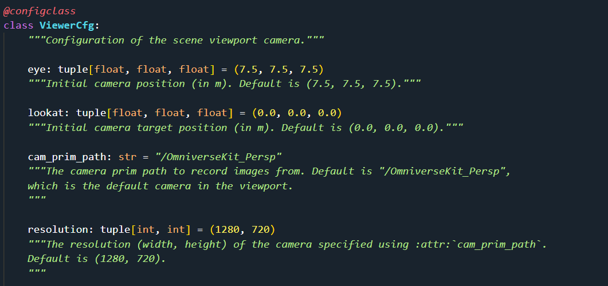

# IsaacLab的使用
目录
[1. Simple examples](#1-simple-examples)
[2. Dive into the code](#2-dive-into-the-code)
[3. Train your own robot](#3-train-your-own-robot)

## 1. Simple examples
<details>
<summary>Ant & Franka Cabinet & Factory NutThread</summary>

### 1.1 Direct Workflow


环境定义文件 `ant_env.py`
`gym.make`配置文件`__init__.py`
`skrl`算法流程配置文件`skrl_ppo_cfg.yaml`


```bash
# 训练
python scripts/reinforcement_learning/skrl/train.py --task Isaac-Ant-Direct-v0 --livestream 2
# or
LIVESTREAM=2 python scripts/reinforcement_learning/skrl/train.py --task Isaac-Ant-Direct-v0 
```

### 1.2 ManageBased Workflow
同上

### 1.3 训练

```bash
# 训练
python -m torch.distributed.run --nnodes=1 --nproc_per_node=4 scripts/reinforcement_learning/rl_games/train.py --task Isaac-Factory-NutThread-Direct-v0 --distributed --headless #分布式训练
python scripts/reinforcement_learning/skrl/train.py --task Isaac-Franka-Cabinet-Direct-v0 --headless # 单机训练
```
### 1.4 结果可视化
```bash
./isaaclab.sh -p scripts/reinforcement_learning/rl_games/play.py --task Isaac-Factory-NutThread-Direct-v0  --num_envs 64  --livestream 2
./isaaclab.sh -p scripts/reinforcement_learning/skrl/play.py --task Isaac-Franka-Cabinet-Direct-v0  --num_envs 64  --video #录制视频
```
</details>


## 2. Dive into the code

<details>
<summary>Code</summary>

<details>
<summary> 2.1 Omniverse App Launched </summary>

train.py
```python
import argparse 
from isaaclab.app import AppLauncher

# add argparse arguments
parser = argparse.ArgumentParser(description="Train an RL agent with skrl.")

# TODO
parser.add_argument("......")

# append AppLauncher cli args
AppLauncher.add_app_launcher_args(parser)
# parse the arguments
args_cli = parser.parse_args()
# launch omniverse app
app_launcher = AppLauncher(args_cli)
simulation_app = app_launcher.app

```
</details>

<details>
<summary> 2.2 Rendering Setting </summary>

train.py <- Direct Workflow
```python
"""Rest everything follows."""
from isaaclab.sim import SimulationCfg, SimulationContext
def main():
    # Initialize the simulation context
    sim_cfg = SimulationCfg(dt=0.01) # dt: rate for rendering,means rendering 100 times per second, default is 1/60.
    sim = SimulationContext(sim_cfg) # render_interval: how many times for physical simulation per rendering step.Default is 1(decimation).
    # Set main camera
    sim.set_camera_view(eye = [2.5, 2.5, 2.5], target = [0.0, 0.0, 0.0]) 
    # Play the simulator
    sim.reset()
    # Now we are ready!
    print("[INFO]: Setup complete...")
    # Simulate physics
    while simulation_app.is_running():
        # perform step
        sim.step()
if __name__ == "__main__":
    # run the main function
    main()
    # close sim app
    simulation_app.close()
```

```python
"""Actually in DirectRLEnvCfg, the viewer port setting and the rendering setting is seperated."""
from isaaclab.envs.common import ViewerCfg
from isaaclab.sim import SimualtionCfg
# from isaaclab.envs import DirectRLEnvCfg,DirectRLEnv
class DirectRLEnvCfg:
    # ...
    viewer: ViewerCfg = ViewerCfg() # 
    sim: SimulationCfg = SimulationCfg()
    # ...
```



```python
# from isaaclab.envs import DirectRLEnvCfg,DirectRLEnv
class DirectRLEnv(gym.Env):
    def __init__(*args,**kwargs):
        # ...
        # create a simulation context to control the simulator
        if SimulationContext.instance() is None:
            self.sim: SimulationContext = SimulationContext(self.cfg.sim)
        else:
            raise RuntimeError("Simulation context already exists. Cannot create a new one.")
        # ...
        if self.sim.render_mode >= self.sim.RenderMode.PARTIAL_RENDERING:
            self.viewport_camera_controller = ViewportCameraController(self, self.cfg.viewer)
        else:
            self.viewport_camera_controller = None
        # ...
"""ViewportCameraController is used to set the viewpoint camera to track different origin types:
    - **world**: the center of the world (static)
    - **env**: the center of an environment (static)
    - **asset_root**: the root of an asset in the scene (e.g. tracking a robot moving in the scene)
"""

```

</details>

>Note:
All the scene designing must happen before the simulation starts. **Once the simulation starts, we recommend keeping the scene frozen and only altering the properties of the prim.** This is particularly important for GPU simulation as adding new prims during simulation may alter the physics simulation buffers on GPU and lead to unexpected behaviors.

<details>
<summary> 2.3 Save Picture </summary>

train.py <- Direct Workflow
```python
from isaaclab.envs import DirectRLEnvCfg,DirectRLEnv
"""
class DirectRLEnv(gym.Env):
    def __init__(*args,**kwargs):
        # ...
    def render(self,recompute:bool=False):
        #...
        # create the annotator if it does not exist
        if not hasattr(self, "_rgb_annotator"):
            import omni.replicator.core as rep

            # create render product
            self._render_product = rep.create.render_product(
                self.cfg.viewer.cam_prim_path, self.cfg.viewer.resolution
            )
            # create rgb annotator -- used to read data from the render product
            self._rgb_annotator = rep.AnnotatorRegistry.get_annotator("rgb", device="cpu")
            self._rgb_annotator.attach([self._render_product]) #当渲染产品生成图像时，附加到它的标注器就会接收到相应的数据。
        # obtain the rgb data
        rgb_data = self._rgb_annotator.get_data()      
        #...
"""
# why DirectRLEnvCfg()？ 
# @configclass 装饰后，会为其 1、添加类型注解, 2、保证每个实例的独特性，不共享内存，3、为类添加额外的功能函数，4、同时将其转换为 dataclass 类型
myenv = DirectRLEnv(DirectRLEnvCfg(),render_mode='rgb_array')
# how to get rgb frame?
rgb_data = myenv.render()
```

```python
# 在 train.py 中
# ...
# create isaac environment
env = gym.make(args_cli.task, cfg=env_cfg, render_mode="rgb_array" if args_cli.video else None)

# convert to single-agent instance if required by the RL algorithm
if isinstance(env.unwrapped, DirectMARLEnv) and algorithm in ["ppo"]:
    env = multi_agent_to_single_agent(env)

# wrap for video recording
if args_cli.video:
    video_kwargs = {
        "video_folder": os.path.join(log_dir, "videos", "train"),
        "step_trigger": lambda step: step % args_cli.video_interval == 0,
        "video_length": args_cli.video_length,
        "disable_logger": True,
    }
    print("[INFO] Recording videos during training.")
    print_dict(video_kwargs, nesting=4)
    env = gym.wrappers.RecordVideo(env, **video_kwargs)
    # 对原有的 env 增加记录视频的功能
# ...
```

main.py
```python
import argparse
from isaaclab.app import AppLauncher
# add argparse arguments
parser = argparse.ArgumentParser(description="Train an RL agent with skrl.")
# append AppLauncher cli args
AppLauncher.add_app_launcher_args(parser)
# parse the arguments
args_cli = parser.parse_args()
args_cli.headless = True
args_cli.enable_cameras = True  # off screen rendering
# launch omniverse app
app_launcher = AppLauncher(args_cli)
simulation_app = app_launcher.app

from isaaclab.envs import DirectRLEnvCfg,DirectRLEnv
# from unitree.tasks.direct.unitree.unitree_env_cfg import UnitreeEnvCfg
# from unitree.tasks.direct.unitree.unitree_env import UnitreeEnv

# myenv = UnitreeEnv(UnitreeEnvCfg(),render_mode='rgb_array')
myenv = DirectRLEnv(DirectRLEnvCfg(),render_mode='rgb_array')
while simulation_app.is_running():
    rgb_data = myenv.render()
    print(1)

# close sim app
simulation_app.close()

```
</details>
</details>

## 3. Train your own robot
<details>
<summary>Unitree H1</summary>

### 2.1 Create external repository
```bash
cd IsaacLab
# 查看已有的具身智能环境
# python scripts/environments/list_envs.py
# 创建环境 external 外部环境 OR internal 内部环境
# 创建方法 direct OR manager-based
./isaaclab.sh --new
```
Once created, navigate to the installed project and run `python -m pip install -e source/<given-project-name>`

### 2.2 Direct Workflow
* **Architecture**


<details>
<summary> Create environment and record frame <summary>

main.py
```python
import argparse
from isaaclab.app import AppLauncher
# add argparse arguments
parser = argparse.ArgumentParser(description="Train an RL agent with skrl.")
# append AppLauncher cli args
AppLauncher.add_app_launcher_args(parser)
# parse the arguments
args_cli = parser.parse_args()
args_cli.headless = True
args_cli.enable_cameras = True  # off set rendering
# launch omniverse app
app_launcher = AppLauncher(args_cli)
simulation_app = app_launcher.app

from isaaclab.envs import DirectRLEnvCfg,DirectRLEnv
from unitree.tasks.direct.unitree.unitree_env_cfg import UnitreeEnvCfg
from unitree.tasks.direct.unitree.unitree_env import UnitreeEnv

myenv = UnitreeEnv(UnitreeEnvCfg(),render_mode='rgb_array')
# myenv = DirectRLEnv(DirectRLEnvCfg(),render_mode='rgb_array')
while simulation_app.is_running():
    rgb_data = myenv.render()
    print(1)

# close sim app
simulation_app.close()
```

source/unitree/unitree/tasks/direct/unitree/unitree_env_cfg.py
```python
# TODO 关节控制
```
source/unitree/unitree/tasks/direct/unitree/unitree_env.py
```python
# TODO 关节状态获取
```
</details>


### 2.3 ManagerBased Workflow

* **Architecture**

详情见 `H1RoughEnvCfg.dot`,vscode 需要安装 `Graphviz Preview` 扩展


* **../mdp/\* 功能函数的作用**
TODO
* **关节运动学属性设置**
TODO
<details>
<summary> 基础环境定义 </summary>

```python
from isaaclab.scene import InteractiveSceneCfg
@configclass
class MySceneCfg(InteractiveSceneCfg):
    # ground terrain 定义地形
    from isaaclab.terrains import TerrainImporterCfg
    # robots 定义机器人
    from isaaclab.assets import ArticulationCfg
    from dataclasses import MISSING
    robot:Articulationcfg = MISSING
    # sensors 定义传感器
    from isaaclab.sensors import ContactSensorCfg,RayCasterCfg
    # Note: The variable "{ENV_REGEX_NS}" represents "/World/envs/env_.*" means the number of robots in training.Such as "/World/envs/env_1/Robot/.*"
    # lights 定义光照
    from isaaclab.assets import AssetBaseCfg

from isaaclab.scene import InteractiveScene
scene=InteractiveScene(MySceneCfg(num_envs=2))
# state()  update()
```

</details>
<details>
<summary>强化学习环境定义</summary>

```python
import isaaclab_tasks.manager_based.locomotion.velocity.mdp as mdp
# mdp 中定义了markov过程中涉及到的所有函数
from isaaclab.managers import ObservationGroupCfg as ObsGroup
# Basical Settings
@configclass
class ObservationsCfg: #定义观察
    @configclass
    class PolicyCfg(ObsGroup):
        # 设置所有观察变量，默认将所有观察到的 tensor concate 到一起
        pass
    policy: PolicyCfg = PolicyCfg()

@configclass
class ActionsCfg: #定义动作
    joint_pos = mdp.JointPositionActionCfg(asset_name="robot", joint_names=[".*"], scale=0.5, use_default_offset=True)
@configclass
class CommadsCfg: # 定义行为规则
    pass

# MDP Settings
@configclass
class EventCfg: #定义事件
    # 在开始（startup)、终止(reset)、周期性的(interval)重置机器人的状态
    pass

from isaaclab.managers import RewardTermCfg as RewTerm
@configclass
class RewardsCfg: #定义奖励信号
    # 基座
    # 奖励xy轴的线速度和绕z轴的角速度，惩罚z轴的线速度和绕xy周的角速度
    track_lin_vel_xy_exp = RewTerm(
        func=mdp.track_lin_vel_xy_exp, weight=1.0, params={"command_name": "base_velocity", "std": math.sqrt(0.25)}
    )
    #惩罚过大关节力矩，惩罚过大关节加速度，惩罚过快的动作变化，奖励滞空->屈膝，惩罚碰撞，（可选）姿态惩罚控制
    
@configclass
class TerminationsCfg: #定义终止条件
    pass

class CurriculumCfg: # curriculum learning
    pass

@configclass
from isaaclab.envs import ManagerBasedRLEnvCfg
class MyRobotEnvCfg(ManagerBasedRLEnvCfg):
    # Scene Settings
    scene:MySceneCfg = MySceneCfg(num_envs=4096,env_spacing=2.5)
    # Basic Settings
    obsevations: ObservationsCfg = ObservationsCfg()
    actions: ActionsCfg = ActionsCfg()
    commands: CommandsCfg = CommandsCfg()
    # MDP settings
    rewards: RewardsCfg = RewardsCfg()
    terminations: TerminationsCfg = TerminationsCfg()
    events: EventsCfg = EventsCfg()
    curriculum:CurriculumCfg = CurriculumCfg()
    def __pos__init__(self):
        # 初值设定
        pass

from isaaclab.envs import ManagerBasedRLEnv
myrobotenv=ManagerBasedRLEnv(MyRobotEnvCfg)
```
</details>

<details>
<summary>unitree H1 的详细定义</summary>

```python
# 继承 RewardsCfg 重写奖励信号
@configclass
class H1Rewards(RewardsCfg):
    pass

# LocomotionVelocityRoughEnvCfg 继承 ManagerBasedRLEnvCfg
# 继承 LocomotionVelocityRoughEnvCfg 重新定义 强化学习环境
@configclass
class H1RoughEnvCfg(LocomotionVelocityRoughEnvCfg)：
    pass
```
</details>


<details>
<summary> 参数迁移与关节调整 </summary>

```bash

```
</details>

### 2.4 skrl algorithm API
TODO
### 2.5 ..../skrl/train.py

<details>
<summary> python </summary>

```bash

```
</details>

### 2.6 ..../skrl/play.py
* 渲染视角设置
```bash
# isaaclab_tasks.manager_based.locomotion.velocity.config.h1.rough_env_cfg.H1RoughEnvCfg()
['actions', 'commands', 'curriculum', 'decimation', 'episode_length_s', 'events', 'is_finite_horizon', 'observations', 'recorders', 'rerender_on_reset', 'rewards', 'scene', 'seed', 'sim', 'terminations', 'validate', 'viewer', 'wait_for_textures', 'xr']
# 默认视角
# isaaclab_tasks.manager_based.locomotion.velocity.config.h1.rough_env_cfg.H1RoughEnvCfg().viewer
ViewerCfg(eye=(7.5, 7.5, 7.5), lookat=(0.0, 0.0, 0.0), cam_prim_path='/OmniverseKit_Persp', resolution=(1280, 720), origin_type='world', env_index=0, asset_name=None, body_name=None)
```
`H1RoughEnvCfg <- LocomotionVelocityRoughEnvCfg <- ManagerBasedRLEnvCfg <- ManagerBasedEnvCfg`

`isaaclab.envs.common.ViewerCfg` 


</details>