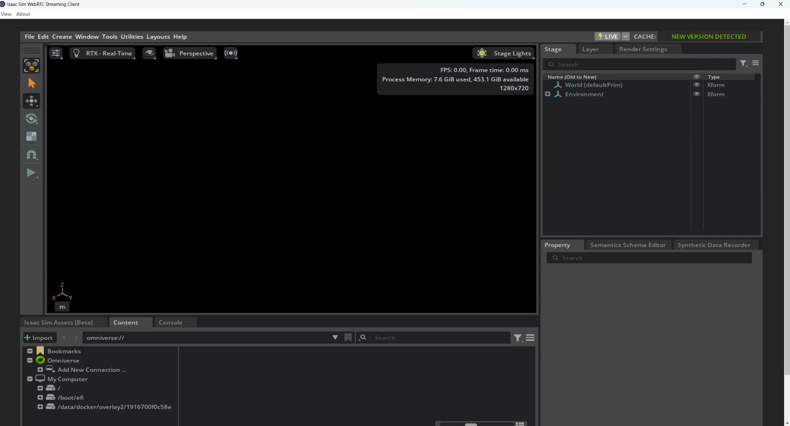

# IsaacSim 安装
### 服务器端
教程来源： https://docs.isaacsim.omniverse.nvidia.com/latest/installation/download.html
```bash
wget https://download.isaacsim.omniverse.nvidia.com/isaac-sim-standalone%404.5.0-rc.36%2Brelease.19112.f59b3005.gl.linux-x86_64.release.zip
unzip -d isaac_sim isaac-sim-standalone@4.5.0-rc.36+release.19112.f59b3005.gl.linux-x86_64.release.zip
```
### 客户端
windows download: https://download.isaacsim.omniverse.nvidia.com/isaacsim-webrtc-streaming-client-1.0.6-windows-x64.exe


### 远程启动
* 服务器
```bash
cd isaac_sim
bash isaac-sim.streaming.sh
```
* 客户端

