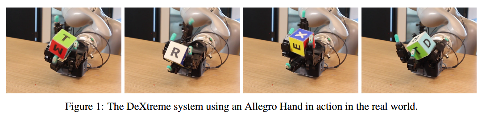

## content

Dexterous Hand</summay>

## 1. Dexterous Hand
### [1.DeXtreme: Transfer of Agile In-hand Manipulation from Simulation to Reality](https://arxiv.org/abs/2210.13702)

Train a robot hand for dexterous manipulation.[Click here to see details](./Dexterous%20Hand/README.md)
### [2.]()

## 2. Humanoid Robot