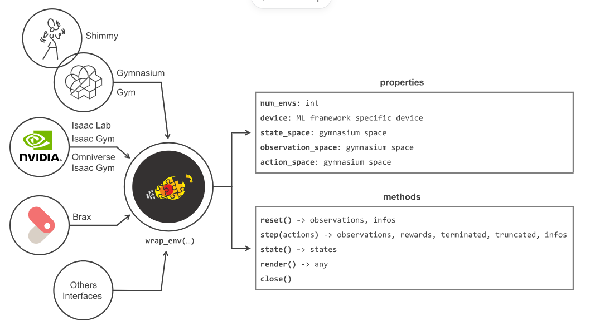
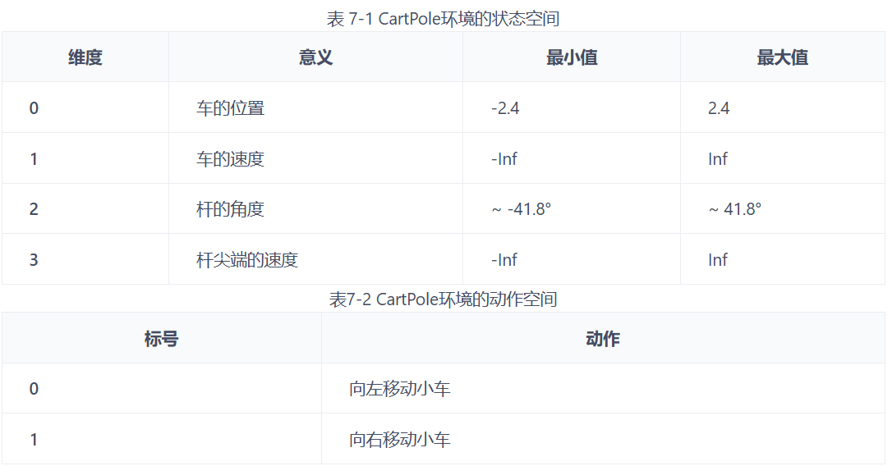
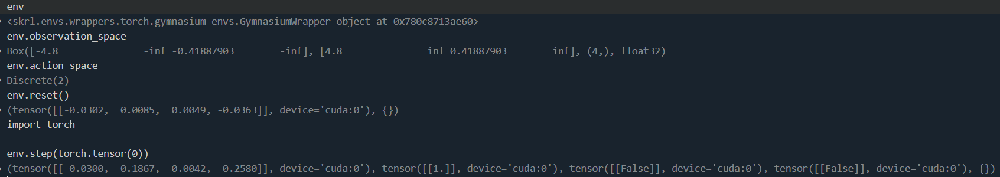

# skrl
This is a repository showcasing the usage of skrl.
### 1. Environments
```python
# 1. Environments
# import the environment wrapper and loader
from skrl.envs.wrappers.torch import wrap_env
from skrl.envs.loaders.torch import load_isaaclab_env
# load the environment
env = load_isaaclab_env(task_name="Isaac-Cartpole-Direct-v0")
# wrap the environment
env = wrap_env(env)  # or 'env = wrap_env(env, wrapper="isaaclab")'

# or

from skrl.envs.wrappers.torch import wrap_env
import gymnasium as gym
# load the environment
env = gym.make("CartPole-v1")
# wrap the environment
env = wrap_env(env)
```
封装环境，开放统一的接口

CartPole环境


示例

### 2. Memories
```python
# 经验回放池
from skrl.memories.torch import RandomMemory
memory = RandomMemory(memory_size=1000, num_envs=env.num_envs, device=device, replacement=False)
```

### 3. Models

### 4. Noises

### 5. Learning rate schedulers

### 6. Preprocessors

### 7. Agents

### 8. Trainers